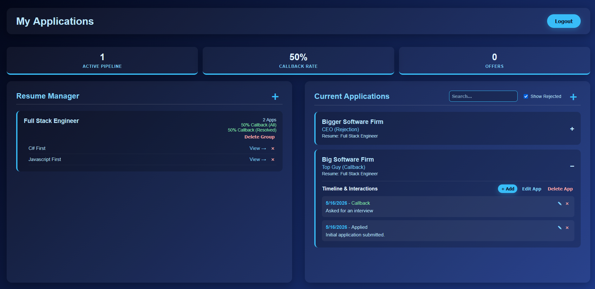

# Application Tracker

**Live App:** [trackyourapplications.org](https://www.trackyourapplications.org)

I built this full-stack application to solve my own problem: managing the chaos of applying to dozens of software engineering roles. It tracks applications, resumes, and interview timelines securely in one dashboard, completely eliminating the need for messy spreadsheets.



## 🚀 Key Features
- **Centralized Tracking:** Log applications, pipeline status, and company interactions.
- **Resume Manager:** Keep track of exactly which version of your resume was sent to which company.
- **Automated Ghosting Detection:** Intelligently flags applications that haven't received a response in 4+ weeks.
- **Native Desktop Widget:** Includes a custom Electron-based Windows system tray widget to quickly log jobs without breaking workflow.

## 🛠️ Architecture & Tech Stack
- **Frontend:** React, Vite
- **Backend:** C#, ASP.NET Core Web API
- **Database:** Entity Framework Core (SQL Server / SQLite)
- **Desktop Shell:** Electron
- **DevOps & Cloud:** Azure App Service, Azure Static Web Apps, GitHub Actions (CI/CD)

### Architecture Overview
The application is decoupled into a standalone RESTful ASP.NET Core API and a Vite React SPA. The React application is deployed to the web via Azure Static Web Apps, but the exact same bundled React code is also wrapped in an Electron shell to provide a seamless, frameless desktop widget that runs in the Windows System Tray. 

## 🧠 Technical Decisions

- **Database Engine Flexibility:**  
  I utilized SQL Server during local development to leverage its powerful relational features and tooling. However, I designed the Entity Framework Core data context to seamlessly fall back to a containerized SQLite instance in production. This allowed me to deploy the entire backend to an Azure App Service F1 free-tier instance while remaining completely within hosting constraints.

- **Cross-Platform Widget Architecture:**  
  By strictly separating the frontend logic from the native desktop shell, I was able to serve the identical React codebase on the web and inside a borderless Windows system tray widget. I utilized CSS `-webkit-app-region` properties to build native drag handles into the React DOM that Electron interprets at the OS level.

- **Security & Multi-Tenancy:**  
  Secured the backend using ASP.NET Core Identity and custom JWT authentication. Every application and interaction is tied to a specific `UserId` extracted securely from the JWT claims to guarantee complete data isolation between users.

## 💻 Running Locally

### Prerequisites
- .NET 8.0 SDK
- Node.js (v18+)

### 1. Backend Setup
```bash
cd ApplicationTracker
```
Initialize .NET User Secrets to securely store your local JWT key (bypassing source control):
```bash
dotnet user-secrets init
dotnet user-secrets set "Jwt:Key" "YourSuperSecretKeyThatIsAtLeast32CharactersLong!"
```
Apply the Entity Framework migrations to build your local SQLite database:
```bash
dotnet ef database update
```
Run the API:
```bash
dotnet run
```
*The API will start at `http://localhost:5224`*

### 2. Frontend Setup
Open a new terminal window:
```bash
cd client-app
npm install
```

**To run the Web App:**
```bash
npm run dev
```

**To run the Desktop Widget:**
```bash
npm run electron
```